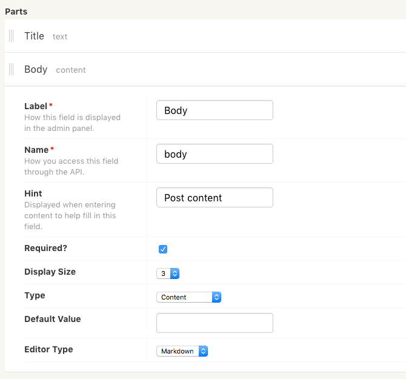
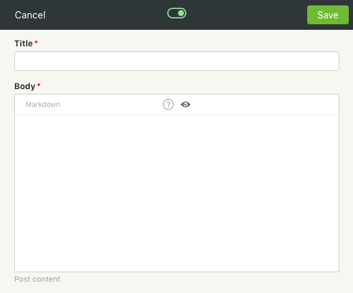

Fridge has been designed to make it easy to create a custom and beautiful content experience. Use this page as a guide to walk through setting up your very own Fridge.

## Content Types

Content types are used to describe the different kinds of content that are needed in a Fridge. Think of content types as high level names to describe content *(i.e. Blog Post, Page, Event, Person, Comment.)* Content types are made up of __parts__ which describe each piece of content that makes up the content type. There are several different content parts to create practically any kind of content type which can be seen in greater detail in the [Parts Reference](/docs/introduction/parts/).

### Creating The First Content Type

After logging into Fridge for the first time, you are presented with a clean slate. This is on purpose as a Fridge should not make any assumptions about what kind of content you need or don't need for your project. As such, create a content type to get started!

To create a new content type, click the + symbol next to the Content title in the sidebar. Go ahead and give your content type a name!

### Adding Parts

_Parts_ are a piece of content used to describe a content type. For example, if you are reading a website article, you can think of the _Title, Url, Meta Title, Author, Date, Body, Comments_ as different parts of the article. There's no limit to how many parts you can add to any particular content type. Construct content types as simple or as complex as you need.

All of the different parts available are explained in the [Parts Reference](/docs/introduction/parts/).

To add a part to your content type, click the Add button. Click the new part row to toggle the part options.

### Options

There are many different options available to both content types and their parts. Options are broken up into a few different categories:

* __Display Options__ - Customize how the content should be displayed in Fridge. There are different layout and field display options as well as sorting capabilities.
* __API Options__ - Control how content can be accessed when using the API as well as react to content creation with email notificatons.
* Check out the [Content Type Reference](/docs/introduction/content-types/) page for a detailed explanation of each available option. 

## Creating Content

After you have created a content type, it will appear in the Fridge sidebar. Clicking on the content type displays a list of all content of that type, as well as ways to create new content. When creating a new piece of content of a particular type, all of the content parts from that type are presented as input fields in a beautiful rich layout.

Once you've created some content, it will be laid out on the content type page. Use the `Edit Model` button to make changes to the parts and options of the content type. Use the `Add New` button to add a new content entry.

## Fridge API

When it is time to starting pulling Fridge content into a project, Fridge provides a robust API to access everything. To get started, you'll need to copy an access key from the *Fridge Settings* page. Clicking on your Fridge's name in the top-left corner will present a dropdown with a link to this page.

There are many ways to integrate Fridge content directly into your projects!

* __[API Libraries](/docs/development/libraries/)__ - Easily bring Fridge content into an existing programming language
* __[Integrations](/docs/development/integrations/)__ - Use existing tools you're already familiar with and let Fridge power the dynamic content.

We're always working to make the integration between existing technology and Fridge content as easy as possible.
